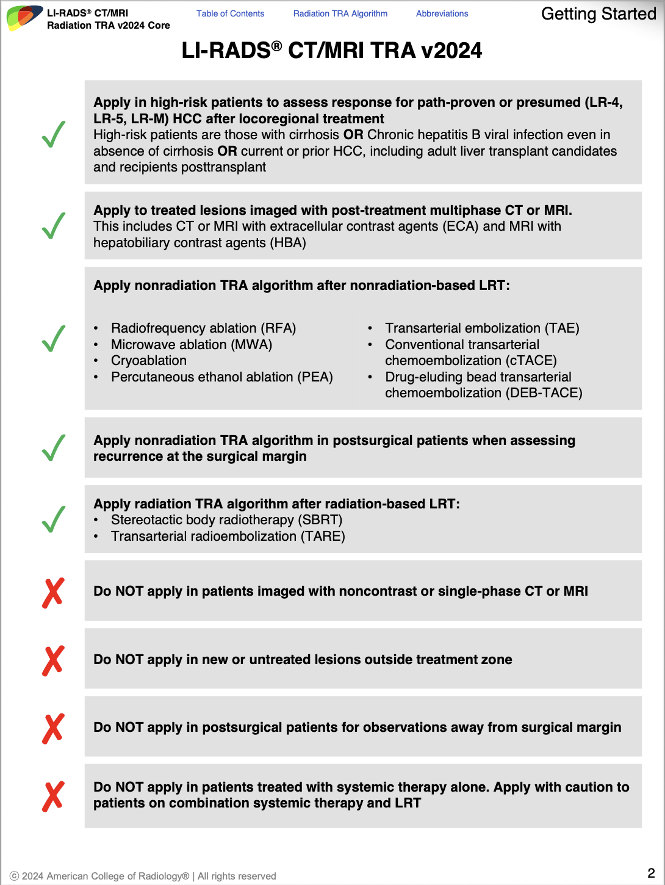
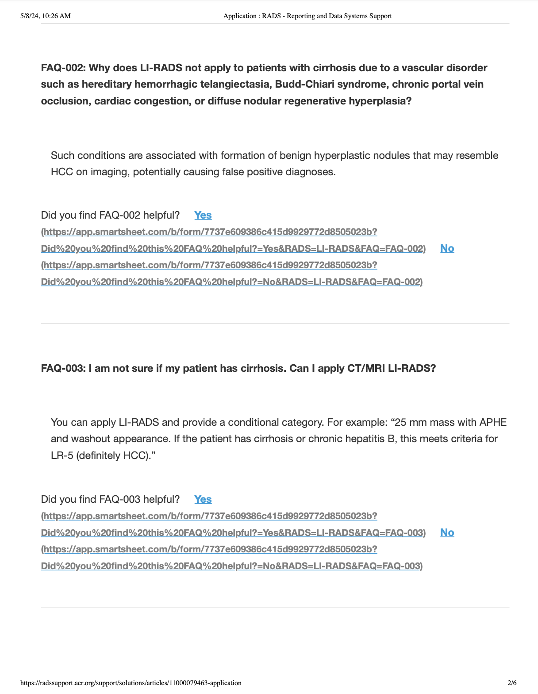
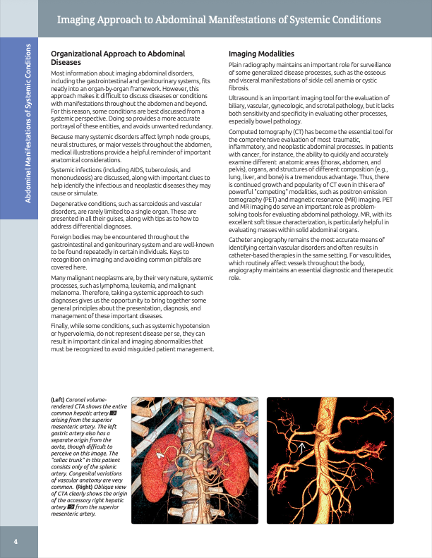
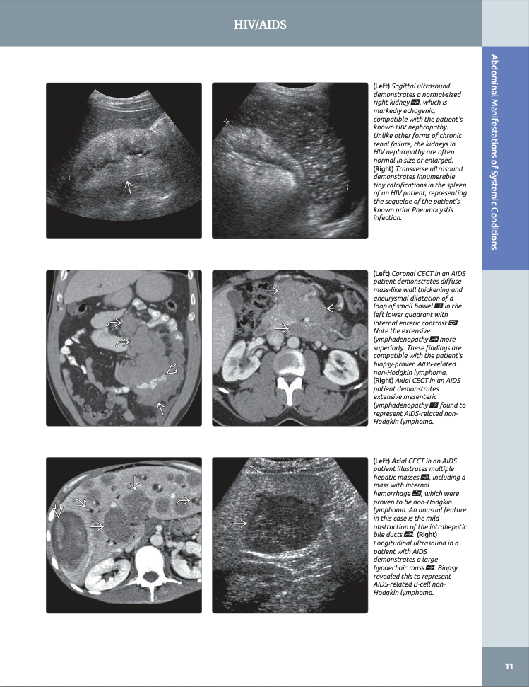
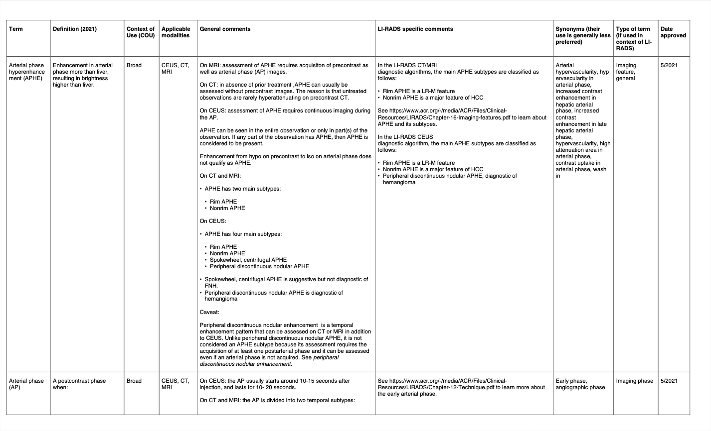
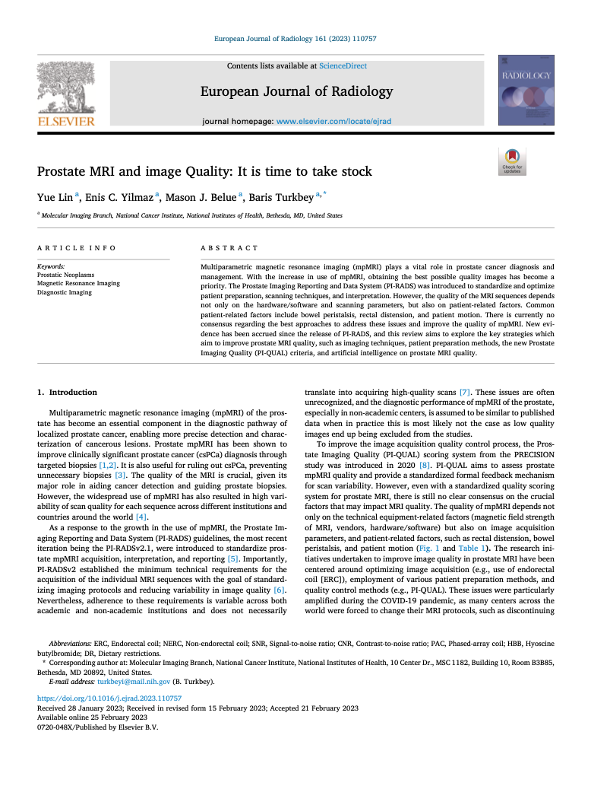
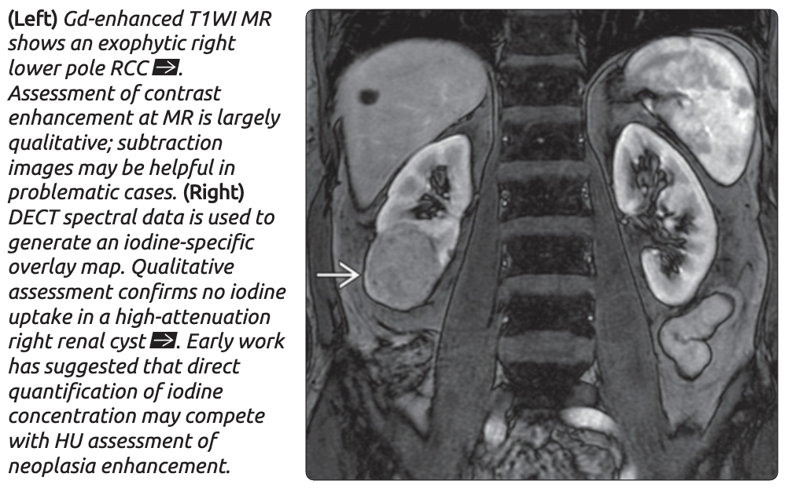

# Model
We are currently exploring the use of  **MinerU** as parser. Previously, other parsers such as PyMuPDF and PyMuPDF4LLM were used. However, they failed at appropriately processing tables. 

One initial challenge faced by our team was the different page formatting and structure between each PDF, and within each file. We remain using MinerU as a parser, but included rule-base decisions to ensure parsing is correct and adjusted for each document. This results in a complex pipeliene with several adaptations for each document. 


# Folder breakdown

We have X documents that can be divided in different groups based on their parsing strategies. In total, we have 5 groups. This is how our folder structure to accommodate for the different processes. In each .py file, we'll add specific post-processing solutions to best improve parsing performance. 

```bash
Data_Ingestion_VDB/
├── data/
│   ├── strategy_1_clinical_image/
│   ...
│   └── strategy_5_research/
│
├── src/
│   ├── parsers/
│   │     ├── __init__.py
│   │     ├── base_parser.py
│   │     ├── strategy_1_clinical_image.py
│   │     ...
│   │     └── strategy_5_research.py
│   │               ├── __init__.py
│   │               ├── main.py              (main pipeline)
│   │               ├── test.py              (visualize parsed and chunked pdf)
│   │               ├── cleaning_rules.yaml  (cleaning config)
│   │               └── post_processor.py    (cleaning logic)
│   ├── embedders.py
│   ├── vector_store.py
│   ├── pipeline.py
│   └── utils.py

```

# Parsing Strategies
Parsing strategies will defer based on which file we work on. Currently, we can divide our dataset in 5 groups of PDF type:

**Strategy 1:** Clinical documents (i.e., LIRADS, PIRADS) that have many images, diagrams and tables. These documents require additional multimodal capabilities.
<p align="center">
  
  <br>
  <em>Figure 2</em>
</p>

**Strategy 2:** Also clinical documents (i.e., LIRADS) formated in a Q&A format. Special parsing and chunking necessary to keep question and answers in same chunk.   
<p align="center">
  
  <br>
  <em>Figure 3</em>
</p>

**Strategy 3:** Medical textbooks.   
<p align="center">
  
  <br>
  <em>Figure 4 - Diagnostic Imaging: Gastrointestinal by Federle and Raman</em>
</p>
<p align="center">
  
  <br>
  <em>Figure 5 - Diagnostic Imaging: Gastrointestinal by Federle and Raman</em>
</p>

**Strategy 4:** Lexicon Tables. There is only one document under this group. 
<p align="center">
  
  <br>
  <em>Figure 6</em>
</p>

**Strategy 5:** Lastly, medical research papers
<p align="center">
  
  <br>
  <em>Figure 7 - Prostate MRI and image Quality: It is time to take stock (Yue Lin, Enis C. Yilmaz, Mason J. Belue, and Baris Turkbey)</em>
</p>


Following, we'll specifically explain the post-processing decisions for each group.

## Strategy 1

## Strategy 2

## Strategy 3

## Strategy 4

## Strategy 5

**Changes for all PDFs:**
Removed:
- Hyphens from word breaks
- Journal headers
- Keywords section
- Location information regarding published article (e.g., "Hesda, MD, United States)
- Author names and affiliations
- Footnotes


---
# ADDITIONAL NOTES, PUT THSI SOMEWHERE LATER

**Keeping the arrows in images as reference:** Another issue we faced was the presence of arrows in some of the images, which were refereced in the caption. The arrows appear in both the image and the captions as a method to guide the student on where to look in the image. Although an incredibly interpretable tool in the human eye, it was a challenge to decide how to embed this reference. We are currently working on the matter.

<p align="center">
  
  <br>
  <em>Figure 1 – Example of arrow reference</em>
</p>

I'm currently exploring the opportunity of using a "two-level image embedding"
1. Image-level embedding -> overall meaning of the image
2. Region-level embedding -> small sub-area

However, this is a *next-step* analysis.

---
